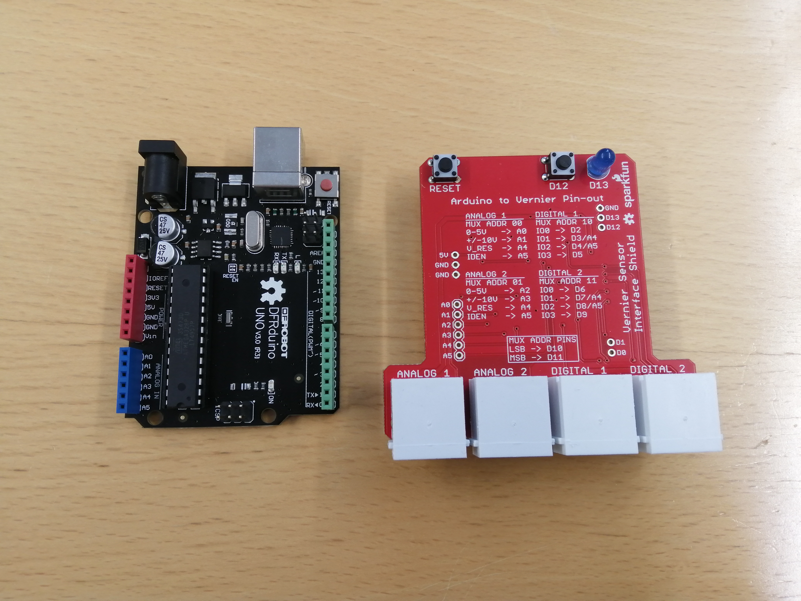

# Arduino Vernier-sensorit
Vernier-sensoreita voi käyttää arduinon kanssa. Ensin yhdistetään arduinoon tarvittava rajapinta.
### Tarvikkeet
- Arduino ja siihen USB-liitäntä
- Vernier sensoreiden rajapinta arduinoon
- Tarvittavia Vernier-sensoreita



Vasemmalla Arduino, Oikealla Rajapinta
&nbsp;


&nbsp;

Arduino ja Rajapinta yhdistettynä. Laita Arduinon ja rajapinnan pinnit siten, että jokainen rajapinnan pinni on kunnolla kiinni Arduinossa.
&nbsp;


> Lataa tietokoneellesi Vernier-kirjasto. Se löytyy Arduino-sovelluksen Työkalut-valikosta kohdasta "hallitse kirjastoja". Kirjoita hakukentään "VernierLib" ja lataa kirjasto.

### Alkuun

Kytke sensori Vernierin rajapinnan analog 1 -porttiin, jos sensori on analoginen, ja jos se on digitaalinen, kytke se digital 1 -porttiin. Kytke vielä arduino USB:llä tietokoneeseen. 

```c++
#include <VernierLib.h>
VernierLib Vernier;
```
Ohjelmassa täytyy olla ylläolevat kaksi riviä, jotta Vernierin funktioita voi käyttää.

### Analogiset sensorit
Kaikki analogiset sensorit toimivat samalla toimintaperiaatteella. Kun sensori on analog 1 -portissa, Vernier tunnistaa sen automaattisesti, kun kutsut Vernier.autoID-funktiota.
```c++
Vernier.autoID();
```
Tunnistuksen jälkeen voit kutsua Vernier.readSensor, jolloin saat float-tyyppisen arvon. Vernier.sensorUnits palauttaa yksikön.
```c++
float sensorValue = Vernier.readSensor();
```

Esimerkkiohjelma, joka tulostaa sensoriarvoja serialiin:

```c++
#include <VernierLib.h>

VernierLib Vernier;

void setup() {
  Vernier.autoID();
  Serial.begin(9600);
}

void loop() {
  float rawData = Vernier.readSensor();

  Serial.print(rawData);
  Serial.print(" ");
  Serial.println(Vernier.sensorUnits());
}
```
#### Analogisten sensorien kalibroiminen
Useimmat Vernierin sensorit on kalibroitu valmiiksi, mutta jos sensori näyttää vääriä lukemia, se pitää kalibroida. Helpoiten se onnistuu seuraavalla menetelmällä:
1. Käytä ylläolevaa ohjelmaa pohjana ja muokkaa loop-funktiota:
```c++
float k = 1;
float b = 0;

void loop() {
  float rawData = Vernier.readSensor();
  float sensorData = k * rawData - b;

  Serial.print(sensorData);
  Serial.print(" ");
  Serial.println(Vernier.sensorUnits());
}
```
2. Nyt on tarkoitus etsiä arvot vakioille k ja b. Mittaa sensori siinä tilanteessa, että sen kuuluisi saada arvoja nolla. Esimerkiksi voimamittarilla niin, että koukku saa levätä vapaasti, jännitemittarilla niin, että päät ovat oikosulussa ja magneettikentän voimakkuuden sensorilla faradayn häkissä. Jos mittarin antama arvo ei ole nolla, ota se muistiin ja korvaa b sillä.
3. Muokkaa ohjelma ja lataa se arduinoon uudelleen
4. Mittaa arvo jollain tunnetulla arvolla, esimerkiksi punnuksella. Esimerkiksi jos voimamittarin koukkuun laitetaan 100g punnus, sen kuuluisi näyttää noin 0.981N. Jos sensorin antama arvo on jokin muu, korvaa k luvulla, jonka saat, kun jaat halutun arvon saadulla arvolla. Esimerkiksi jos haluttu arvo on 0.981 mutta sensori näyttää 12.00, k = 9.81/12.00 = 0.8175.
### Digitaaliset sensorit

Jos käytät digitaalista sensoria, eli liiketunnistinta (Motion Detector), valotunnistinta (Photogate), säteilymittaria (Radiation Monitor), pisaralaskuria (Drop Counter) tai pyörimissensoria (Rotary Motion Sensor), tässä osassa neuvotaan jokainen sensori erikseen.

#### Motion Detector
Saat kalibroidun etäisyyden käyttämällä Vernier.readMotionDetector-funktiota:
```c++
float distance = Vernier.readMotionDetector();
```

#### Photogate
Valotunnistin antaa digitaalisen HIGH-arvon, kun sitä ei peitetä ja LOW:n, kun se on peitetty.
```c++
#DEFINE PHOTOGATE_PIN 2
int photogateStatus = digitalRead(PHOTOGATE_PIN);
```
#### Radiation Monitor
Säteilymittari antaa HIGH:n, kun se havaitsee säteilyä ja LOW:n, kun säteilyä ei havaita.
```c++
#DEFINE RADIATION_MONITOR_PIN 2
int radiationMonitorStatus = digitalRead(RADIATION_MONITOR_PIN);
```
#### Drop Counter
Pisaralaskuri antaa HIGH:n, kun se havaitsee pisaran ja LOW:n, kun pisaraa ei ole.
```c++
#DEFINE DROP_COUNTER_PIN 2
int dropCounterStatus = digitalRead(DROP_COUNTER_PIN);
```

#### Rotary Motion Sensor
Pyörimissensori vaatii hyvin tarkan ohjelman, jotta se toimii oikein. Katso mallia sivulta https://www.vernier.com/engineering/arduino/digital-sensors/rotary-motion/

